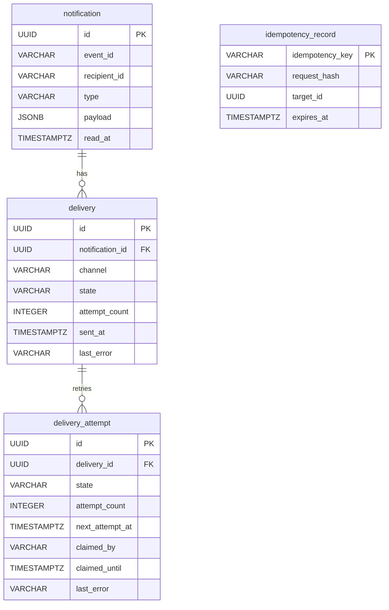

# BE-C Notification System

Spring Boot 기반 알림 발송 시스템 과제 구현입니다.  
이벤트 발생 시 사용자에게 `EMAIL` 또는 `IN_APP` 알림을 비동기 처리로 발송하며, 중복 방지, 재시도, 장애 복구, 다중 인스턴스 환경을 고려했습니다.

## 프로젝트 개요

- 알림 등록 API는 요청을 즉시 접수하고, 실제 발송은 별도 worker가 처리합니다.
- `IN_APP` 알림은 등록 트랜잭션 안에서 즉시 `SENT` 처리합니다.
- `EMAIL` 알림은 DB 기반 큐(`delivery_attempt`)를 통해 비동기 발송합니다.
- 실제 메시지 브로커(Kafka, SQS 등)는 사용하지 않았고, 현재는 DB polling worker로 구현했습니다.
- 대신 알림 등록, 작업 적재, 작업 획득, 실제 발송 책임을 분리해 두어 운영 환경에서는 polling/claim 부분을 브로커 consumer로 교체할 수 있게 설계했습니다.
- 동일 이벤트 중복 발송 방지를 위해 3계층 dedup을 적용했습니다.
  - 1차: `notification` 수준 dedup
  - 1.5차: `delivery` 수준 dedup
  - 2차: `Idempotency-Key` 기반 replay 방지
- 서버 재시작, 일시 장애, 다중 인스턴스 동시 처리, stuck recovery까지 고려했습니다.

## 기술 스택

- Java 21
- Spring Boot 3.4.5
- Spring Web / Validation / Data JPA / Security / Actuator
- PostgreSQL 16
- Flyway
- Micrometer + Prometheus
- Springdoc OpenAPI
- JUnit 5 / AssertJ / Awaitility
- Testcontainers
- ArchUnit

## 실행 방법

### 1. 사전 요구사항

- Java 21
- Docker

### 2. PostgreSQL 실행

```bash
docker compose up -d postgres
```

### 3. 애플리케이션 실행

```bash
./gradlew bootRun
```

기본 접속 정보:

- App: `http://localhost:8080`
- Swagger UI: `http://localhost:8080/swagger-ui.html`
- Prometheus endpoint: `http://localhost:8080/actuator/prometheus`

기본 DB 설정:

- DB host: `localhost`
- DB port: `5432`
- DB name: `notification`
- DB user: `notification`
- DB password: `notification`

환경변수로 override 가능합니다.

## 요구사항 해석 및 가정

### 요구사항 해석

- 알림 발송 실패가 비즈니스 트랜잭션에 영향을 주면 안 되므로, 등록과 발송을 분리했습니다.
- 다만 “예외를 그냥 무시”하지 않기 위해 발송 시도는 `delivery_attempt` 로 영속화하고, 상태 전이와 실패 사유를 남기도록 설계했습니다.
- “동일 이벤트 중복 발송 방지”는 헤더 없는 일반 요청도 막아야 하므로 `event_id + recipient_id + type` 수준의 dedup을 기본으로 잡았습니다.
- 실제 메시지 브로커는 쓰지 않되 운영 환경으로 전환 가능해야 하므로, DB polling worker + lease + reaper 구조로 구현했습니다.
- 이 구조에서 비즈니스 규칙은 `DeliveryRelayService` 와 상태 전이에 남기고, 작업 획득 메커니즘만 교체 가능하게 두었기 때문에 향후 Kafka/SQS consumer로의 전환 범위를 인프라 계층으로 제한할 수 있습니다.

### 주요 가정

- `Notification` 은 논리적 이벤트 1건이며, 채널은 `Delivery` 의 속성입니다.
- `IN_APP` 은 외부 네트워크 전송이 아니라 내부 알림함 적재로 간주해 등록 즉시 `SENT` 처리합니다.
- `EMAIL` 은 mock adapter로 처리하며, 실제 SMTP/SES 연동은 확장 포인트로 남겼습니다.
- `read_at` 은 사용자가 알림 자체를 읽었는지에 대한 상태이며, `IN_APP` 전달 성공이 있어야만 읽음 처리 가능합니다.

### 개선 의견

- 실제 운영 전환 시에는 DB polling 대신 Kafka/SQS 같은 브로커로 바꾸는 것이 적절합니다.
- 현재 `X-Admin-Token` 기반 관리자 보호는 과제 범위에 맞춘 단순 구현이며, 실제 운영이라면 OAuth2/JWT가 적합합니다.
- 장기 운영에서는 6개월 보관 정책용 cleanup worker, real SMTP, bounce webhook, tracing이 추가되어야 합니다.

## 설계 결정과 이유

### 1. 단일 모델

- JPA Entity와 Domain Model을 분리하지 않고 하나의 모델로 유지했습니다.
- 이유:
  - 과제 범위에서 매핑 boilerplate를 줄일 수 있음
  - 도메인 상태 전이와 영속 모델을 한 곳에서 읽을 수 있음

### 2. 3 Aggregate 구조

- `Notification`: 알림 이벤트 자체
- `Delivery`: 채널별 전달 상태
- `DeliveryAttempt`: 재시도/claim/recovery를 위한 작업 단위

이렇게 분리한 이유:

- 사용자에게 보여줄 상태와 worker 재시도 상태를 분리할 수 있음
- `EMAIL` retry session을 별도 row로 추적 가능
- admin retry 시 새 시도 row를 발급할 수 있음

### 3. 3계층 dedup

- 1차: `UNIQUE(event_id, recipient_id, type)`
- 1.5차: `UNIQUE(notification_id, channel)`
- 2차: `Idempotency-Key`

이유:

- 헤더 없는 일반 요청도 중복 방지해야 함
- fan-out 과정에서 채널 중복도 막아야 함
- API replay safety는 별도 계층으로 보강해야 함

### 4. 비동기 처리 구조

- API는 등록만 수행
- worker가 `delivery_attempt` 의 `READY` row를 polling하여 claim 후 처리
- claim 시 `FOR UPDATE SKIP LOCKED` + lease(`claimed_until`) 사용
- stuck row는 reaper가 복구

이유:

- 실제 브로커 없이도 운영형 비동기 구조를 흉내낼 수 있음
- 다중 인스턴스 환경에서도 중복 처리를 줄일 수 있음
- 서버 재시작 후에도 미처리 row가 남아 유실되지 않음

### 5. retry / failure 정책

- 일시 장애는 재시도
- 영구 실패는 즉시 실패 종료
- 최대 재시도 초과 시 `DEAD`
- 실패 사유는 `delivery`, `delivery_attempt` 양쪽에 기록

이유:

- 재시도는 하되 무한 루프는 막아야 함
- 운영자가 최종 실패 원인을 확인할 수 있어야 함

### 6. 운영 대응

- `ReaperWorker`: lease 만료된 stuck claim 복구
- `AdminRetry`: 최종 실패 건 수동 재시도
- cleanup worker: terminal attempt / expired idempotency 정리
- metrics / k6 / ArchUnit 추가

## 미구현 / 제약사항

- 실제 이메일 발송은 구현하지 않았고 mock adapter로 대체했습니다.
- 실제 메시지 브로커는 사용하지 않았습니다.
- 발송 예약 기능은 미구현입니다.
- 타입별 알림 템플릿 관리 기능은 미구현입니다.
- multi-device read sync는 단일 `read_at` 모델로 단순화했습니다.
- `same Idempotency-Key + different request body` 가 동시에 들어오는 경쟁 상황은 `first-write-wins` 정책으로 정리했고, 더 강한 직렬화는 구현하지 않았습니다.

## AI 활용 범위

- 설계 초안 브레인스토밍
- 상태 전이/aggregate 분리 검토
- 테스트 보강 아이디어 정리
- 문서/ADR 초안 작성 보조

최종 설계 결정, 코드 수정, 테스트 검증, 요구사항 충족 여부 판단은 직접 확인하며 반영했습니다.

## API 목록 및 예시

### 1. 알림 등록

`POST /v1/notifications`

요청 예시:

```json
{
  "eventId": "payment-1001",
  "recipientId": "user-1",
  "type": "PAYMENT_CONFIRMED",
  "channels": ["EMAIL", "IN_APP"],
  "payload": {
    "subject": "결제가 완료되었습니다",
    "body": "수강 신청이 확정되었습니다"
  }
}
```

응답 예시:

```json
{
  "id": "3f6f3cbe-5b31-4f4f-91a8-0c3d0e06836e",
  "eventId": "payment-1001",
  "recipientId": "user-1",
  "type": "PAYMENT_CONFIRMED",
  "read": false,
  "deliveries": [
    {
      "channel": "EMAIL",
      "state": "PENDING"
    },
    {
      "channel": "IN_APP",
      "state": "SENT"
    }
  ]
}
```

헤더:

- 신규 등록: `202 Accepted`
- 이벤트 중복: `X-Event-Duplicate: true`
- idempotency replay: `X-Idempotent-Replay: true`

### 2. 단건 조회

`GET /v1/notifications/{id}`

### 3. 사용자 알림 목록 조회

`GET /v1/notifications?recipientId=user-1&read=false&page=0&size=20`

### 4. 읽음 처리

`PATCH /v1/notifications/{id}/read`

- `IN_APP` 전달 성공 건에 대해서만 허용

### 5. 관리자 재시도

`POST /v1/admin/notifications/{id}/retry`

헤더:

```text
X-Admin-Token: dev-token-do-not-use-in-prod
```

## 데이터 모델 설명

### 핵심 테이블

#### notification

- 알림 이벤트 자체
- 주요 컬럼:
  - `id`
  - `event_id`
  - `recipient_id`
  - `type`
  - `payload`
  - `read_at`

#### delivery

- 채널별 전달 상태
- 주요 컬럼:
  - `id`
  - `notification_id`
  - `channel`
  - `state`
  - `attempt_count`
  - `sent_at`
  - `last_error`

#### delivery_attempt

- worker가 처리하는 retry/claim 단위
- 주요 컬럼:
  - `id`
  - `delivery_id`
  - `state`
  - `attempt_count`
  - `next_attempt_at`
  - `claimed_by`
  - `claimed_until`
  - `last_error`

#### idempotency_record

- idempotency key replay 방지용
- 주요 컬럼:
  - `idempotency_key`
  - `request_hash`
  - `target_id`
  - `expires_at`

### ERD



스키마는 [V1__init.sql](/C:/assignment/src/main/resources/db/migration/V1__init.sql) 에 정의되어 있습니다.

## 비동기 처리 구조 및 재시도 정책 설명

### 비동기 처리 구조

1. API 요청은 `notification`, `delivery`, `delivery_attempt` 를 같은 트랜잭션으로 저장합니다.
2. `EMAIL` 채널은 `delivery_attempt(state=READY)` 로 큐에 적재됩니다.
3. `DispatchWorker` 가 주기적으로 claim 가능한 row를 가져옵니다.
4. claim 후 adapter를 호출하고 결과에 따라 `SENT`, `READY`, `FAILED`, `DEAD` 로 전이합니다.
5. worker가 중간에 죽어 claim이 오래 유지되면 `ReaperWorker` 가 다시 `READY` 로 되돌립니다.

### 재시도 정책

- `TransientFailure`: backoff 후 재시도
- `PermanentFailure`: 즉시 실패 종료
- 최대 재시도 초과: `DEAD`
- 수동 재시도:
  - admin endpoint로 새 `delivery_attempt` 를 발급
  - 누적 `delivery.attempt_count` 는 유지
  - session 단위 `delivery_attempt.attempt_count` 는 새 row에서 다시 시작

## 테스트 실행 방법

### 전체 테스트 실행

```bash
./gradlew test
```

현재 기준:

- 39 test classes
- 81 tests
- 81/81 pass

### 테스트 범위

- 도메인 invariant 단위 테스트
- retry / adapter / relay service 단위 테스트
- dedup / replay / mark-read / retry / recovery / admin / cleanup 통합 테스트
- ArchUnit 아키텍처 규칙 테스트

## 저장소 구성

```text
src/main/java/com/livenotification
├─ notification
├─ delivery
├─ idempotency
├─ admin
└─ global

src/test/java/com/livenotification
├─ architecture
├─ delivery
├─ idempotency
├─ integration
└─ notification
```
