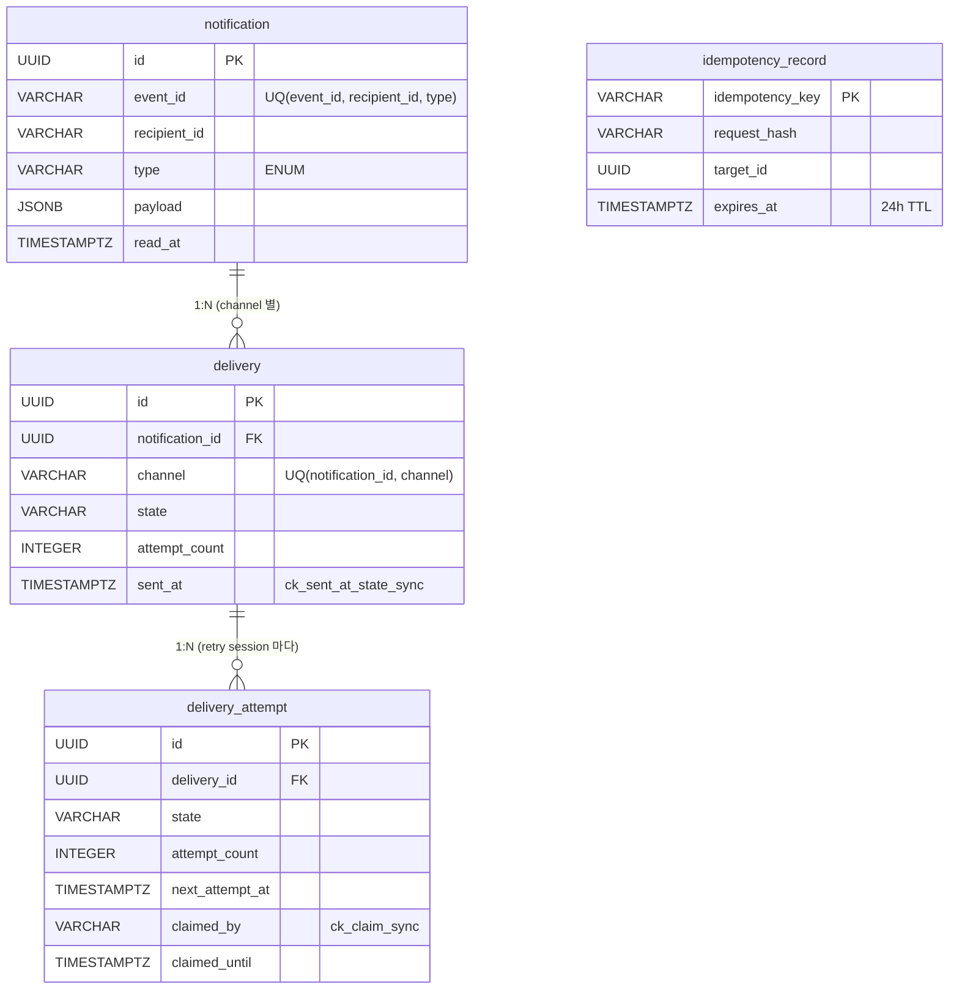

# BE-C Notification System

LiveClass 채용 과제 — 알림 발송 시스템 구현. Spring Boot 3.4 + Java 21 + PostgreSQL 16.

## 목차

1. [프로젝트 개요](#1-프로젝트-개요)
2. [기술 스택](#2-기술-스택)
3. [실행 방법](#3-실행-방법)
4. [명세 매핑](#4-명세-매핑)
5. [핵심 설계 결정](#5-핵심-설계-결정)
6. [테스트 전략](#6-테스트-전략)
7. [부하 시험 결과](#7-부하-시험-결과)
8. [Path C 확장 sketch](#8-path-c-확장-sketch)
9. [AI 활용 문서](#9-ai-활용-문서)

---

## 1. 프로젝트 개요

LiveClass 채용 과제 — 알림 발송 시스템. Spring Boot 3.4.5 + Java 21 + PostgreSQL 16.

### 핵심 frame

- **Path B (channel-as-transport)**: notification 1 = 사용자 event 1. channel 별 delivery N. fan-out 자연 표현.
- **3-Layer Dedup**: 1차 (notification UNIQUE), 1.5차 (delivery UNIQUE), 2차 (Idempotency-Key header + 24h TTL).
- **Outbox 1-tx N-aggregate**: 등록 시점 한 트랜잭션 안에 notification + delivery N + delivery_attempt N + idempotency_record 0/1 = 최대 6 INSERT.
- **IN_APP 즉시 SENT**: IN_APP delivery 는 worker 안 거치고 등록 시 즉시 SENT (invariant #4). EMAIL 만 worker 가 폴링.
- **운영 끝판**: ReaperWorker (stuck recovery) + AdminRetry + Micrometer 11 metrics + ArchUnit 6 rules.

### 5분 컷 시나리오 (8 step)

| # | 시점 | 동작 | 기대 |
|---|---|---|---|
| 1 | 0s | `docker compose up -d postgres` + `./gradlew bootRun` | Spring Boot 부팅 + Flyway V1__init.sql 자동 적용 + 8080 listen |
| 2 | 5s | `curl -X POST /v1/notifications -d '{"eventId":"e1","recipientId":"u1","type":"PAYMENT_CONFIRMED","channels":["EMAIL","IN_APP"],"payload":{"subject":"hello","body":"world"}}'` | 202 + body `deliveries[2]` (EMAIL PENDING, IN_APP SENT) + `X-Event-Duplicate: false` |
| 3 | 6s | `curl GET /v1/notifications/{id}` | IN_APP delivery state=SENT (즉시), EMAIL delivery state=PENDING |
| 4 | 7s | (worker 1초 후 자동 dispatch) GET 재호출 | EMAIL delivery state=SENT (worker 처리 완료) |
| 5 | 10s | 같은 event_id 로 다시 POST | 200 + `X-Event-Duplicate: true` (1차 dedup) |
| 6 | 12s | POST + `Idempotency-Key: k1`, 다시 POST + `Idempotency-Key: k1` (같은 body) | 첫 202, 두 번째 200 + `X-Idempotent-Replay: true` |
| 7 | 15s | `payload.x_test_failure=transient` 로 POST → DEAD 후 admin retry: `POST /v1/admin/notifications/{id}/retry -H "X-Admin-Token: dev-token-do-not-use-in-prod"` | 204 + delivery 재기동 |
| 8 | 20s | `curl /actuator/prometheus \| grep notification` | 11개 metrics 노출 (`notification_registered_total`, `delivery_dispatched_total`, `delivery_dead_total` 등) |

### 디렉터리 구조

```
src/main/java/com/livenotification/
├── notification/        <- Notification AR + 등록 흐름 + 3-layer dedup
├── delivery/            <- Delivery + DeliveryAttempt AR + worker + retry
├── idempotency/         <- Idempotency-Key 헤더 기반 2차 dedup
├── admin/               <- 운영 endpoint (X-Admin-Token)
└── global/              <- 공통 config (Properties, WorkerConfig, SecurityConfig)
```

## 2. 기술 스택

| 영역 | 라이브러리 | 사유 |
|---|---|---|
| Runtime | Java 21 | record, sealed interface, Virtual Thread |
| Framework | Spring Boot 3.4.5 | Auto-config + Actuator + Security + Data JPA + Validation |
| 영속 | PostgreSQL 16 + JPA + Hibernate 6.5+ | JSONB native + SKIP LOCKED + FK CASCADE |
| Migration | Flyway 10.x | V1__init.sql 단일 마이그레이션 |
| 빌더 | Lombok | `@NoArgsConstructor(PROTECTED)`, `@Getter` (no `@Setter`), `@RequiredArgsConstructor` |
| 동시성 | Virtual Thread + Semaphore + SKIP LOCKED | 외부 I/O 중심 worker, multi-instance race 방어 |
| Observability | Micrometer + Prometheus + Grafana | 11개 metric + 6 panel 대시보드 (`infra/grafana/`) |
| API 문서 | Springdoc OpenAPI 2.6.0 | `/swagger-ui.html`, controller `@Tag` 1줄만 |
| Test | JUnit 5 + AssertJ + Awaitility + Testcontainers + ArchUnit 1.3.0 | 77 tests (38 unit + 33 IT + 6 ArchUnit) |
| 부하 시험 | k6 | dedup-race + throughput (`infra/k6/`) |

## 3. 실행 방법

### 사전 요구사항

- Docker (PostgreSQL 16 컨테이너 용)
- Java 21 JDK (Gradle toolchain 자동 provisioning 도 가능)
- (선택) k6 (부하 시험 용)

### 시작

```bash
# 1. PostgreSQL 컨테이너 시작
docker compose up -d postgres

# 2. Spring Boot 실행 — Flyway 가 V1__init.sql 자동 적용
./gradlew bootRun
```

### 검증 curl 예제

```bash
# 등록 (channels=[EMAIL, IN_APP]) — 202 + X-Event-Duplicate: false
curl -X POST http://localhost:8080/v1/notifications \
  -H "Content-Type: application/json" \
  -d '{"eventId":"demo-1","recipientId":"u1","type":"PAYMENT_CONFIRMED","channels":["EMAIL","IN_APP"],"payload":{"subject":"hello","body":"world"}}'

# 중복 이벤트 재등록 — 200 + X-Event-Duplicate: true
curl -X POST http://localhost:8080/v1/notifications \
  -H "Content-Type: application/json" \
  -d '{"eventId":"demo-1","recipientId":"u1","type":"PAYMENT_CONFIRMED","channels":["EMAIL","IN_APP"],"payload":{"subject":"hello","body":"world"}}'

# Idempotency-Key replay — 첫 POST 202, 두 번째 POST 200 + X-Idempotent-Replay: true
curl -X POST http://localhost:8080/v1/notifications \
  -H "Content-Type: application/json" \
  -H "Idempotency-Key: my-key-1" \
  -d '{"eventId":"demo-2","recipientId":"u1","type":"PAYMENT_CONFIRMED","channels":["EMAIL"],"payload":{"subject":"hello","body":"world"}}'

# 조회
curl http://localhost:8080/v1/notifications/{id}

# IN_APP markRead (IN_APP delivery 가 SENT 일 때만 성공 — 204)
curl -X POST http://localhost:8080/v1/notifications/{id}/read

# 관리자 재기동 (X-Admin-Token 필요; 기본 dev-token-do-not-use-in-prod)
curl -X POST http://localhost:8080/v1/admin/notifications/{id}/retry \
  -H "X-Admin-Token: dev-token-do-not-use-in-prod"

# Prometheus 메트릭
curl http://localhost:8080/actuator/prometheus | grep notification
```

### Swagger UI

`http://localhost:8080/swagger-ui.html` — REST API 자동 문서.

### 환경 변수

| 변수 | 기본값 | 설명 |
|---|---|---|
| `DB_HOST` | `localhost` | PostgreSQL 호스트 |
| `DB_PORT` | `5432` | PostgreSQL 포트 |
| `DB_NAME` | `notification` | 데이터베이스 이름 |
| `DB_USER` | `notification` | 사용자명 |
| `DB_PASSWORD` | `notification` | 비밀번호 |
| `ADMIN_TOKEN` | `dev-token-do-not-use-in-prod` | production 에서 반드시 override |

---

## 4. 명세 매핑

LiveClass 명세 5조건 ↔ 본 과제 구현 파일/메서드.

| # | 명세 조건 | 구현 |
|---|---|---|
| 1 | **알림 등록 + 채널 fan-out** — `POST /v1/notifications` 단일 호출로 notification 1건 + channel 수만큼 delivery 생성. IN_APP 은 등록 시점 즉시 SENT, EMAIL 은 worker 가 폴링해 발송. 응답 body 에 `deliveries[]` 포함. | `NotificationController.register` → `NotificationService.register` → `NotificationRegistrationStore.insertOrLoad` (notification INSERT) → `DeliveryRegistrar.scheduleFor` (delivery + delivery_attempt INSERT). IN_APP: `Delivery.forInApp` + `DeliveryAttempt.completedFor` (state=SENT/DONE, 동일 트랜잭션). EMAIL: `Delivery.forEmail` + `DeliveryAttempt.readyFor` (state=PENDING/READY). 파일: `src/main/java/com/livenotification/notification/adapter/in/web/NotificationController.java`, `src/main/java/com/livenotification/notification/application/NotificationService.java`, `src/main/java/com/livenotification/delivery/adapter/in/registrar/DeliveryRegistrarAdapter.java` |
| 2 | **3-Layer Dedup** — 동일 이벤트 중복 발송 방지 (1차·1.5차) + API 재전송 안전성 (2차). 응답 헤더 `X-Event-Duplicate` / `X-Idempotent-Replay` 독립 노출. | 1차: `NotificationRegistrationStore.insertIfAbsent` — `INSERT ... ON CONFLICT (event_id, recipient_id, type) DO NOTHING RETURNING id`. 1.5차: `uq_delivery_per_channel (notification_id, channel)` DB 제약 (DeliveryRegistrarAdapter). 2차: `IdempotencyService.persistIfAbsent` — `INSERT ... ON CONFLICT (idempotency_key) DO NOTHING`. 헤더: `NotificationController` → `RegisterResult.eventDuplicate()` / `RegisterResult.replay()`. 파일: `src/main/java/com/livenotification/notification/application/NotificationRegistrationStore.java`, `src/main/java/com/livenotification/idempotency/application/IdempotencyService.java` |
| 3 | **Retry + DLQ** — 전송 실패 시 backoff retry, 영구 실패 fast-fail, max attempts 초과 시 delivery DEAD. `DeliveryAttempt` row 가 retry 큐 역할. | (Phase 3 구현 예정) `RetryPolicy.nextBackoff` + `DeliveryRelayService.relay` — Transient failure → attempt_count++ + next_attempt_at 갱신 (READY 재진입). Permanent failure / attempt_count >= max → delivery DEAD. `DispatchWorker` — `SELECT ... FOR UPDATE SKIP LOCKED` 폴링 + Virtual Thread. 파일 (Phase 3): `src/main/java/com/livenotification/delivery/application/` (DeliveryRelayService), `src/main/java/com/livenotification/delivery/domain/` (RetryPolicy) |
| 4 | **운영 가능성** — admin retry (DEAD delivery 복귀), stuck 행 복구 (reaper), Micrometer metrics 11개 (dispatch throughput / latency / queue depth / dead count 포함). | (Phase 4 구현 예정) `ReaperWorker` (`@Scheduled(30s)`) — `claimed_until` lease 만료 행 복구. `AdminRetryService` — `DeliveryRetryRegistrar.issueNewAttempt` + `delivery.markPending` (attempt_count 유지). Micrometer counter/timer/gauge 11개. 파일 (Phase 4): `src/main/java/com/livenotification/delivery/adapter/in/scheduler/`, `src/main/java/com/livenotification/admin/` |
| 5 | **재기동 안전 (Durability)** — 서버 재기동과 무관하게 발송 의도 손실 없음. Outbox 패턴 (notification + delivery + delivery_attempt 동일 트랜잭션 commit). Flyway 단일 init migration. DB state 가 진실의 원천. | `NotificationService.register` — `@Transactional` 한 트랜잭션 안에 notification 1 + delivery N + delivery_attempt N + idempotency_record 0~1 commit (최대 6 INSERT). `DeliveryRegistrarAdapter` — `@Transactional(propagation = MANDATORY)` 로 호출자 트랜잭션 강제. Flyway `V1__init.sql` 단일 파일. 재기동 후 `DispatchWorker` 가 READY 행 재폴링. 파일: `src/main/java/com/livenotification/notification/application/NotificationService.java`, `src/main/java/com/livenotification/delivery/adapter/in/registrar/DeliveryRegistrarAdapter.java`, `src/main/resources/db/migration/V1__init.sql` |

---

## 5. 핵심 설계 결정

### 5.1 3-Layer Dedup

**Signature**: "동일 이벤트 중복 발송 방지는 notification-level UNIQUE 와 delivery-level UNIQUE 가 함께 보장하고, API 재전송 안전성은 별도의 idempotency key 로 보완한다."

| Layer | UNIQUE 제약 | 동작 시점 | 응답 헤더 |
|---|---|---|---|
| 1차 | `uq_notification_event (event_id, recipient_id, type)` | notification INSERT 시점 — `NotificationRegistrationStore.insertIfAbsent` 가 `INSERT ... ON CONFLICT DO NOTHING RETURNING id` 실행 | `X-Event-Duplicate: true` (HTTP 200) |
| 1.5차 | `uq_delivery_per_channel (notification_id, channel)` | delivery INSERT 시점 — `DeliveryRegistrarAdapter.scheduleFor` 내 fan-out 루프. 같은 channel 두 번 요청 거부 | (헤더 없음, 내부 DB 제약으로 처리) |
| 2차 | `idempotency_record.idempotency_key` PK + 24h TTL | 요청 헤더 `Idempotency-Key` 있을 때만. `NotificationService.register` 진입 시 `IdempotencyService.lookupCurrent` 호출 | `X-Idempotent-Replay: true` (HTTP 200) |

#### 응답 헤더 독립성

`X-Event-Duplicate` 와 `X-Idempotent-Replay` 는 독립 boolean fact. 한 헤더의 값이 다른 헤더를 결정하지 않는다.

| 시나리오 | X-Event-Duplicate | X-Idempotent-Replay | HTTP 상태 |
|---|---|---|---|
| 신규 event + Idempotency-Key 없음 | false | false | 202 |
| 중복 event + Idempotency-Key 없음 | true | false | 200 |
| HitSameHash replay (Idempotency-Key 재사용) | true | true | 200 |
| 중복 event + Idempotency-Key 재사용 | true | true | 200 |

설명: `IdempotencyResult.HitSameHash` 경로에서 `loadReplay(id, true)` 를 호출 — `eventDuplicate=true` 를 unconditional 하게 세팅. underlying event 가 이미 등록되어 있다는 사실을 정직하게 헤더에 노출. `IdempotencyReplayIT` Case A~D 참조.

코드 위치: `NotificationService.register` 내 `case IdempotencyResult.HitSameHash hit -> { return loadReplay(new NotificationId(hit.targetId()), true); }` (`src/main/java/com/livenotification/notification/application/NotificationService.java`).

#### 1차 dedup 의 동시성 race 처리

`NotificationRegistrationStore.insertIfAbsent` 는 `INSERT ... ON CONFLICT (event_id, recipient_id, type) DO NOTHING RETURNING id` 패턴. 100 thread 동시에 같은 `(event_id, recipient_id, type)` 요청 시 → 1건만 INSERT 성공, 나머지 99건은 `RETURNING id` 가 빈 결과 → `findByEventIdAndRecipientIdAndType` 으로 기존 row fetch → 200 + `X-Event-Duplicate: true`. `ConcurrentDedupIT` 에서 검증.

JPA persistence-context 가 unique violation 으로 오염되지 않는 장점 — `NamedParameterJdbcTemplate` 직접 호출이므로 Hibernate session 을 거치지 않는다. `try/catch DataIntegrityViolationException` 패턴보다 안정적.

```java
// NotificationRegistrationStore.insertIfAbsent
return jdbcTemplate.query("""
    INSERT INTO notification (id, event_id, recipient_id, type, payload, created_at, updated_at)
    VALUES (:id, :eventId, :recipientId, :type, CAST(:payload AS jsonb), :createdAt, :updatedAt)
    ON CONFLICT (event_id, recipient_id, type) DO NOTHING
    RETURNING id
    """, params, rs -> rs.next() ? (UUID) rs.getObject("id") : null);
```

#### 2차 dedup atomic write

`IdempotencyService.persistIfAbsent` 도 동일 패턴 — `INSERT INTO idempotency_record ... ON CONFLICT (idempotency_key) DO NOTHING`. 100 thread 동시 같은 key 요청 시 1건만 INSERT, 나머지는 no-op. `lookupCurrent` 의 read-before-write race 는 `MANDATORY` 트랜잭션 안에서 read → insert 순서로 처리.

### 5.2 channel = transport (Path B)

#### v3.3 → v3.4 reshape

본 시스템의 설계는 두 번의 큰 reshape 를 거쳤다.

| 버전 | frame | 한계 |
|---|---|---|
| v3.3 | channel = notification identity. `Notification` 안에 채널 정보 포함, 채널 별로 별 entity. | fan-out 시나리오 / multi-channel notification 표현이 부자연. read_at 의 owner 가 모호 (어느 channel 의 read?) |
| v3.4 (현재) | channel = transport. `Notification` = 논리적 사건 (1 row), `Delivery` = 채널별 전달 (N row, channel 별), `DeliveryAttempt` = retry 큐. | (Path C 에서 더 확장 가능) |

#### 4가지 정당화

1. **read_at 의 owner 가 명확해짐** — `Notification.read_at` 은 *사용자가 알림 자체를 읽었는가* 의 단일 boolean. 채널 별 read 추적은 IN_APP delivery 의 SENT 상태로 derive (invariant #2: read_at NOT NULL 가능은 IN_APP SENT 일 때만).
2. **dedup signature 가 단순** — 1차 dedup = `(event_id, recipient_id, type)` 만, channel 무관. fan-out 시에도 같은 event 는 한 번만 등록.
3. **fan-out 모델링 자연스러움** — `channels: ["EMAIL", "IN_APP"]` 요청 = notification 1 + delivery 2. 각 delivery 의 state machine 독립.
4. **Path C 자연 확장** — channel 추가 (SMS, push) 가 entity 변경 0, application service 변경 0. DB schema 변경만 (CHECK constraint 의 enum 확장).

#### 트레이드오프 정직 표기

- **read_at 의 cross-AR 검증** — `NotificationService.markRead` 가 `deliveryRepository.existsByNotificationIdAndChannelAndState(id, IN_APP, SENT)` 를 호출. Notification 과 Delivery 가 별 AR 이므로 entity 안에서 검증 X. 검증 책임은 application service.
- **`X-Event-Duplicate` 와 idempotency replay 의 관계** — replay 경로에서도 `eventDuplicate=true` 를 노출 (5.1 헤더 독립성 표 참조). short-circuit 가 아닌 *factual* 응답.

[원본 grill 이력]: `C:\Users\kim\.gstack\projects\assignment\kim-main-design-20260516-210124.md` (v3.4 Path B)

### 5.3 동시성 3중 방어

알림 시스템에서 발생할 수 있는 동시성 위협 3가지를 *각기 다른 layer* 에서 방어한다.

| Layer | 위협 | 방어 |
|---|---|---|
| 1. 다중 인스턴스 worker | 같은 delivery_attempt 를 두 인스턴스가 동시에 처리 | `SELECT ... FOR UPDATE SKIP LOCKED` (`DeliveryAttemptRepository.findClaimableIds`) + `claimByIds` bulk update with `state = 'READY'` guard |
| 2. 단일 인스턴스 내 외부 채널 보호 | 100 thread 가 동시에 외부 SMTP 에 폭주 | `Semaphore(semaphore-permits=16, fair)` — `DispatchWorker.dispatchAsync` 에서 `tryAcquire` + Virtual Thread submit. permit ownership 은 task 로 *이전* (이중 release 방지) |
| 3. Stuck worker | 워커가 중도 사망 / hang 시 row 가 영구 IN_PROGRESS | `claimed_until` lease (30s) + reaper (`ReaperWorker` — Task 24 pending) 가 만료 row 를 `state=READY` 로 복귀. `DeliveryRelayService.releaseExpiredClaims` 구현 완료 |

#### 왜 Virtual Thread + Semaphore 인가

본 시스템의 worker 작업 = *외부 I/O 중심* (SMTP 호출, DB transaction). Platform thread 대신 Virtual Thread 를 쓰면 *수천 동시 dispatch* 도 OS thread 수 제약 없이 처리. Semaphore 는 *외부 채널* 의 분당 호출량을 캡 (외부 SMTP rate limit 보호) — Virtual Thread 의 동시성을 *명시적으로 제한* 하는 신호.

`DispatchWorker.dispatchAsync` 의 permit ownership transfer 패턴 (`src/main/java/com/livenotification/delivery/adapter/in/scheduler/DispatchWorker.java`):

1. `tryAcquire(1, TimeUnit.SECONDS)` 성공 → `acquired=true`
2. `virtualThreadExecutor.submit(...)` 성공 → permit 책임이 task 로 이전, outer flag `acquired=false`
3. Task 의 `finally` 가 `semaphore.release()`
4. `submit` 실패 (`RejectedExecutionException`) → outer `finally` 가 release (`acquired` flag 가 아직 `true`)

이 패턴으로 *어떤 경로로 끝나든 permit 누수 0*.

#### dispatch-timeout 의 위치

`DeliveryRelayService.invokeAdapter` 안에서 `CompletableFuture.supplyAsync(...).get(timeout, MILLIS)`. `TimeoutException` 은 `TransientFailure` 로 분류 — 재시도 큐에 다시 들어감. `dispatch-timeout (5s prod / 500ms test) < claim-lease (30s)` 관계로, 타임아웃이 reaper 보다 먼저 발동되어 ungraceful path 없이 자연스러운 retry. 파일: `src/main/java/com/livenotification/delivery/application/DeliveryRelayService.java`.

### 5.4 ERD



---

## 6. 테스트 전략

### 6.1 Slice 분류

| 슬라이스 | 도구 | 사용처 |
|---|---|---|
| Pure JUnit 단위 | JUnit 5 + AssertJ | VO compact constructor / entity invariant / RetryPolicy |
| `@WebMvcTest` | mocked services | Controller + DTO + ProblemDetail (Phase 6 후속 추가) |
| `@DataJpaTest` | Testcontainers | Repository custom query 검증 (Phase 6 후속 추가) |
| `@SpringBootTest` | Testcontainers + `AbstractIntegrationTest` | 33개 IT — 등록/dedup/retry/markRead/recovery/admin/cleanup |

### 6.2 Tier 분류

| Tier | 범위 | 포함 테스트 | 현재 개수 |
|---|---|---|---|
| Tier 1 — 핵심 invariant 단위 | 도메인 invariant + retry policy + 스키마 + 채널 adapter + worker | NotificationInvariantTest (3), DeliveryInvariantTest (5), DeliveryAttemptInvariantTest (5), IdempotencyRecordInvariantTest (2), NotificationSchemaTest (1), DeliverySchemaConstraintTest (1), RequestHashTest (5), RetryPolicyTest (7), EmailAdapterTest (4), InAppAdapterTest (2), DispatchWorkerTest (2), DeliveryRelayServiceTest (1) | 38 |
| Tier 2 — 명세 5조건 흐름 IT | 등록 + 3-layer dedup + retry + IN_APP 즉시 SENT + markRead 검증 | integration/dedup (8): ConcurrentDedupIT, EventDedupNoHeaderIT, IdempotencyConflictIT, DeliveryPerChannelDedupIT, IdempotencyReplayIT (4 cases). integration/markread (2): MarkReadEmailOnlyRejectIT, MarkReadInAppSuccessIT. integration/retry (6): RetrySuccessIT, RetryMaxAttemptsIT, PermanentFailureIT, DeliveryAttemptCountCumulativeIT, StateNonCorrespondenceIT, InAppImmediateSentIT | 16 |
| Tier 3 — eng review 후속 IT | stuck recovery + admin retry + multi-worker + 대표 사용자 시나리오 + payload immutability + cleanup | integration/recovery (3): StuckRecoveryIT, MultiWorkerIT, DurabilityIT. integration/admin (4): AdminRetryIT. integration/tier3 (7): NotificationFlowIT, AdminRetryUsesCurrentPayloadIT, HeaderAndEventCompositionIT, MultiChannelFanOutIT, NotificationPayloadImmutabilityIT (2), PartialChannelFailureIT. integration/cleanup (3): DeliveryAttemptCleanupIT, IdempotencyExpiryIT (2) | 17 |
| ArchUnit | 아키텍처 경계 규칙 | ArchitectureTest (6 @ArchTest) | 6 |

`./gradlew test` 결과: 77 tests (Tier 1 = 38, Tier 2 = 16, Tier 3 = 17, ArchUnit = 6). BUILD SUCCESSFUL.

### 6.3 시간 가속 (test profile)

`src/test/resources/application-test.yml` override:

- `notification.retry.base-delay: 100ms` (prod 30s → 300배 가속)
- `notification.retry.max-attempts: 3` (prod 5)
- `notification.worker.poll-interval: 200ms` (prod 1s)
- `notification.worker.dispatch-timeout: 500ms` (prod 5s)
- `notification.worker.semaphore-permits: 4` (prod 16)

prod 15분 retry cycle 이 test ~1.5s 안에 완료.

### 6.4 Testcontainers 운영

- `AbstractIntegrationTest` (`src/test/java/com/livenotification/integration/support/AbstractIntegrationTest.java`) — static `PostgreSQLContainer<>("postgres:16-alpine").withReuse(true)` + `@DynamicPropertySource` 로 DataSource 주입. `~/.testcontainers.properties` 에 `testcontainers.reuse.enable=true` 설정 시 JVM 안 모든 IT 가 같은 컨테이너 공유 → 부팅 가속.
- Windows + Docker Desktop 환경 호환: `build.gradle.kts` 에 `DOCKER_HOST=npipe:////./pipe/docker_engine_linux` + `api.version=1.44` 설정.
- `@BeforeEach truncate` — async worker 가 별 트랜잭션 commit 하므로 명시 truncate 로 격리.

---

## 7. 부하 시험 결과

`infra/k6/` 2 스크립트:

### 7.1 dedup-race.js

100 VU 가 같은 event_id 로 1회씩 동시 POST. 기대: 1×202 + 99×200(X-Event-Duplicate=true).

실행:
```bash
docker compose up -d postgres && ./gradlew bootRun &   # 백그라운드 실행
sleep 15   # 부팅 대기
k6 run infra/k6/dedup-race.js
```

기대 결과:
- `event_accepted_202`: 정확히 1 (PostgreSQL `INSERT ... ON CONFLICT DO NOTHING` 의 원자 보장)
- `event_duplicate_200`: 정확히 99
- 모든 응답 `http_req_failed < 1%`

### 7.2 throughput.js

100 RPS 60초 지속. 각 iteration 마다 unique event_id (dedup 자극 X). channels=[EMAIL, IN_APP] 로 fan-out.

실행:
```bash
k6 run infra/k6/throughput.js
```

기대 (튜닝 출발 threshold):
- `http_req_duration p(95) < 500ms`
- `http_req_failed < 1%`

> 본 과제는 development 환경 (Docker Desktop / 로컬 PG / Gradle dev mode) 에서 실행 — production-grade 환경 (PG 별 인스턴스 + tuned Hikari) 에서 추가 측정 권장.

---

## 8. Path C 확장 sketch

본 과제는 4시간~12시간 마감 / 5조건 충족 / 정직한 미구현 표기 가 목표 (CEO plan). 아래 12 항목은 *production deployment 시 추가될 layer*. **현재 미구현, 본 README 의 의도된 명시**.

| # | 항목 | 이유 (왜 현 단계 미구현) | 확장 hook |
|---|---|---|---|
| 1 | EmailBatch (~30s 윈도우) | 본 과제는 1 notification = N delivery (즉시). batch 는 외부 SMTP rate-limit 보호 목적. | `delivery.batch_id` 컬럼 추가 + `DispatchWorker` 가 `GROUP BY batch_id` |
| 2 | RecipientPreference (선호 채널) | admin UI 가 본 과제 scope 외. | `recipient_preference` 테이블 + `NotificationService.register` 에서 channels 필터 |
| 3 | Bounce webhook (SMTP → auto-DEAD) | mock EmailAdapter 만 구현. 실제 SMTP 통합이 없음. | `/v1/webhooks/email/bounce` endpoint + delivery.markDead |
| 4 | Real SMTP (JavaMailSender) | mock 모드로 충분 (`x_test_failure` injection). | `EmailAdapter.send` 안 JavaMailSender 주입 |
| 5 | Template engine | payload freeform JSONB 로 충분. Mustache/Freemarker + locale hook 미적용. | EmailAdapter 안 template engine 호출 |
| 6 | OTel tracing | Micrometer + Prometheus 만. OTel exporter 미적용. | `micrometer-tracing-bridge-otel` 의존성 + tracer bean |
| 7 | Real broker (Kafka) | DB polling 으로 충분 (~50 RPS 기준). | DispatchWorker 의 `claimBatch` → `KafkaListener` 로 swap. delivery_attempt 가 곧 topic message. |
| 8 | Scheduled delivery | 즉시 발송만 지원. `next_attempt_at` 컬럼 재사용으로 확장 가능. | API 의 `scheduledAt` 필드 + delivery.create 시 next_attempt_at=scheduledAt |
| 9 | Multi-device read sync | `notification.read_at` 단일 컬럼만. 디바이스 별 read 추적 미적용. | `notification_read_per_device(notification_id, device_id, read_at)` 테이블 |
| 10 | OAuth2 admin auth | X-Admin-Token (timing-safe compare) 으로 충분. OAuth2 Resource Server 미적용. | `spring-boot-starter-oauth2-resource-server` + JwtDecoder bean |
| 11 | NotificationCleanupWorker + DeliveryCleanupWorker (6개월 retention) | 본 과제는 delivery_attempt (30일) + idempotency (24h) cleanup 만 구현. 6개월 retention worker 미구현. | `@Scheduled` 일 1회 + `repository.deleteExpired`. FK ON DELETE CASCADE 로 notification 삭제 시 delivery + delivery_attempt 모두 cascade 삭제. |
| 12 | UUIDv7 (time-ordered ID) | `UUID.randomUUID()` (v4) — production 대량 트래픽 시 B-tree page split 비용. 본 과제 볼륨 (100K/일, ~1.2 RPS 평균) 에서 이득 거의 0. JDK 21 native impl 없음. | `com.github.f4b6a3:uuid-creator` lib + entity factory 의 `UUID.randomUUID()` 호출만 교체 |

#### 우선순위 (production readiness)

- **즉시 추가 (alert blocker)**: #3 Bounce webhook, #6 OTel tracing
- **24~48h 작업**: #1 EmailBatch, #4 Real SMTP, #10 OAuth2
- **장기 (broker 전환)**: #7 Real broker
- **튜닝성**: #11 Cleanup worker (6개월 retention), #12 UUIDv7

#### "설계는 깊게, 설명은 정직하게" 시그너처

본 과제의 *명시적* 미구현 정책 — CEO plan 의 결정. 미구현 항목을 *발견되지 않은 채로* 두는 것 보다 *명시 + 이유 + 확장 hook* 로 표기. 인터뷰어가 *시스템 설계 사고* 를 평가할 수 있도록.

---

## 9. AI 활용 문서

본 과제 진행에 사용한 AI 도구 + 출력물.

### 사용 흐름

1. **brainstorming**: Claude `/superpowers:brainstorming` — 도메인 frame + 14 핵심 결정 (channel-as-transport, 3-layer dedup, Outbox 1-tx N-aggregate, Virtual Thread + Semaphore, IN_APP 즉시 SENT 등)
2. **plan-ceo-review**: gstack `/plan-ceo-review` — Phase-parallel README + "설계는 깊게, 설명은 정직하게" 시그너처
3. **plan-eng-review**: gstack `/plan-eng-review` — 17 IT 시나리오 분류 + Tier 분류
4. **writing-plans**: Claude `/superpowers:writing-plans` — 본 plan (`docs/superpowers/plans/2026-05-16-be-c-notification-implementation.md`) 34 task 분해
5. **subagent-driven-development**: Claude `/superpowers:subagent-driven-development` — 본 plan 실행. task 단위로 implementer dispatch + spec/quality reviewer 검토. 일부 task (특히 T17) 는 Codex 가 직접 수정 + Claude 가 이후 task 부터 Codex 스타일 패턴 학습 후 적용.

### 주요 출력물 (chronological)

- `docs/document.md` — design v3.4 (8 § sections)
- `docs/superpowers/specs/2026-05-16-be-c-notification-code-spec-design.md` — 코드 레벨 spec
- `docs/superpowers/plans/2026-05-16-be-c-notification-implementation.md` — 34-task implementation plan
- `~/.gstack/projects/assignment/ceo-plans/2026-05-16-be-c-notification-path-b.md` — CEO plan (정직 미구현)
- `~/.gstack/projects/assignment/kim-main-eng-review-test-plan-20260516.md` — eng test plan
- `~/.gstack/projects/assignment/kim-main-design-20260516-210124.md` — v3.4 design grill 전체 이력 (channel-as-identity → channel-as-transport reshape 정당화)

### 코딩 스타일

본 코드베이스는 entity 저장을 *primitive* 로 하고 (UUID/String/int), VO 접근을 manual getter 로 wrap 하는 *double-getter* 패턴. 1차/2차 dedup 은 `INSERT ... ON CONFLICT DO NOTHING` (NamedParameterJdbcTemplate) 으로 atomic 처리 — JPA try/catch DataIntegrityViolation 패턴보다 persistence-context 안전.

### v3.3 → v3.4 전환 이력 요약

초기 설계(v3.3)는 channel 이 notification identity 의 일부였다 (channel-as-identity). grill 과정에서 multi-channel fan-out 표현과 read_at 의 owner 문제가 드러나면서 v3.4 에서 channel = transport 로 reshape. 전체 grill 이력: `~/.gstack/projects/assignment/kim-main-design-20260516-210124.md`.
